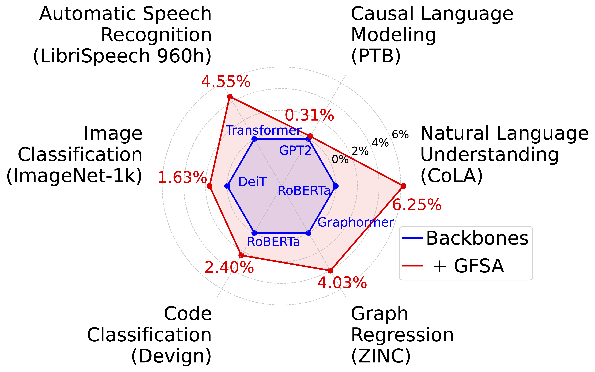

<div align=center>
<h1>Graph Convolutions Enrich the Self-Attention in Transformers!</h1>

 
 [](https://arxiv.org/abs/2312.04234) [](https://hits.seeyoufarm.com)

<div>
      <a href="https://www.jeongwhanchoi.com" target="_blank"><b>Jeongwhan Choi</b></a><sup>1*</sup>,
      <a href="https://scholar.google.co.kr/citations?user=-foMLcAAAAAJ&hl=en" target="_blank">Hyowon Wi</a><sup>2*</sup>,
    <a href="https://scholar.google.co.kr/citations?user=3qbSHGwAAAAJ&hl=en" target="_blank">Jayoung Kim</a><sup>2</sup>,
    <a href="https://scholar.google.com/citations?user=svpxCY4AAAAJ&hl=en" target="_blank">Yehjin Shin</a><sup>2</sup>,
      <a href="https://klee44.github.io" target="_blank">Kookjin Lee</a><sup>3</sup>,
      <a href="https://scholar.google.com/citations?user=6iLMZkwAAAAJ&hl=en" target="_blank">Nathaniel Trask</a><sup>4</sup>,
      <a href="https://sites.google.com/view/noseong" target="_blank">Noseong Park</a><sup>2</sup>,
    <div>
    <sup>1</sup>Yonsei University, <sup>2</sup>KAIST, <sup>3</sup>Arizona State University, <sup>4</sup>University of Pennsylvania
    </div>
</div>
</div>

---

## 📢 News!
- **Dec 11, 2024**: We presented [our work](https://neurips.cc/virtual/2024/poster/94193) at NeurIPS 2024! 🚀
    - 🖼️ See [our poster](https://neurips.cc/media/PosterPDFs/NeurIPS%202024/94193.png?t=1733675592.777139)
    - 📄 Read [the paper](https://arxiv.org/abs/2312.04234)
    - 📽️ Watch [the video presentation](https://neurips.cc/virtual/2024/poster/94193) and [slides](https://neurips.cc/media/neurips-2024/Slides/94193_0yIQJyD.pdf)
- **Dec 3, 2024**: 🏆 With this work, Jeongwhan Choi and Hyowon Wi have won a [2024 Qualcomm Innovation Fellowship](https://www.qualcomm.com/research/university-relations/innovation-fellowship/2024-south-korea)!
- **Dec 9, 2024**: Our source code is available now!
- **Oct 23, 2024**: 🏆 With this work, Jeongwhan Choi and Hyowon Wi were qualified as [a Qualcomm Innovation Fellowship Finalist in the field of AI/ML](https://www.qualcomm.com/research/university-relations/innovation-fellowship/2024-south-korea).
- **Sep 26, 2024**: Our paper has been accepted to NeurIPS 2024! 🎉

## Introduction

- Graph Filter-based Self-Attention (**GFSA**) is a novel approach to enhance the self-attention mechanism in Transformers. 
- By redesigning self-attention from a graph signal processing (GSP) perspective, GFSA addresses the oversmoothing problem and improves performance for various domains.

#### Key Features:
- Easily integrates with existing Transformer models
- Improves performance with minimal computational overhead
- GFSA shows significant improvements across various tasks on multiple domains



---

## Tasks and Directories 

The detailed guidance is included in the `README.md` of each subdirectory:

1. 🖼️ Image Classification 👉 [`./Image`](./Image)

2. 📚 Natural Language Understanding 👉 [`./NLP`](./NLP)

3. 🧠 Causal Language Modeling  👉 [`./NLP`](./NLP)

4. 🌐 Graph Regression 👉 [`./Graph`](./Graph)

5. 🎙️ Speech Recognition  👉 [`./Speech`](./Speech)

6. 💻 Code Classification  👉 [`./Code`](./Code)

---

## Implementation Example with the Pseudocode

GFSA's core implementation is shown in the following pseudocode:

```python
def GFSA(att, K):
    """
    Graph Filter-based Self-Attention
    
    Args:
        att: original self-attention matrix
        K: order of high-order term
        
    Notes:
        w_0, w_1 can be set in two ways:
        1) As learnable parameters
        2) Fixed as hyperparameters (w_0=0, w_1=1)
    
    Returns:
        gf_att: GFSA attention matrix
    """
    # Initialize weights
    w_0 = torch.zeros(h)  # identity term weight
    w_1 = torch.ones(h)   # first-order term weight  
    w_K = torch.zeros(h)  # high-order term weight
    I = torch.eyes(n)[None, None, ...]
    
    # Compute high-order term using Taylor approximation
    att_K = att + (K-1) * (torch.mm(att,att) - att)
    
    # Combine terms with weights
    gf_att = w_0[None, :, None, None] * I + \
             w_1[None, :, None, None] * att + \
             w_K[None, :, None, None] * att_K
             
    return gf_att
```

### Key Implementation Features

- **Weight Initialization**: `w_0`, `w_1` can be either learnable parameters or fixed hyperparameters
- **High-order Term**: Uses Taylor approximation to reduce computational cost
- **Minimal Parameters**: Adds only a small number of parameters compared to base models

### Integration Example

```python
from models.attention import GFSA

# Replace original self-attention with GFSA
attention_output = GFSA(
    att=attention_scores,  # original attention matrix
    K=3                    # order of high-order term
)
```

---


## Citation
If you use this code for your research, please cite our paper:

```
@inproceedings{choi2024gfsa,
   title={Graph Convolutions Enrich the Self-Attention in Transformers!},
   author={Jeongwhan Choi and Hyowon Wi and Jayoung Kim and Yehjin Shin and Kookjin Lee and Nathaniel Trask and Noseong Park},
   booktitle={The Thirty-eighth Annual Conference on Neural Information Processing Systems},
   year={2024},
   url={https://openreview.net/forum?id=ffNrpcBpi6}
}
```

## Star History

[](https://star-history.com/#jeongwhanchoi/GFSA&Date)